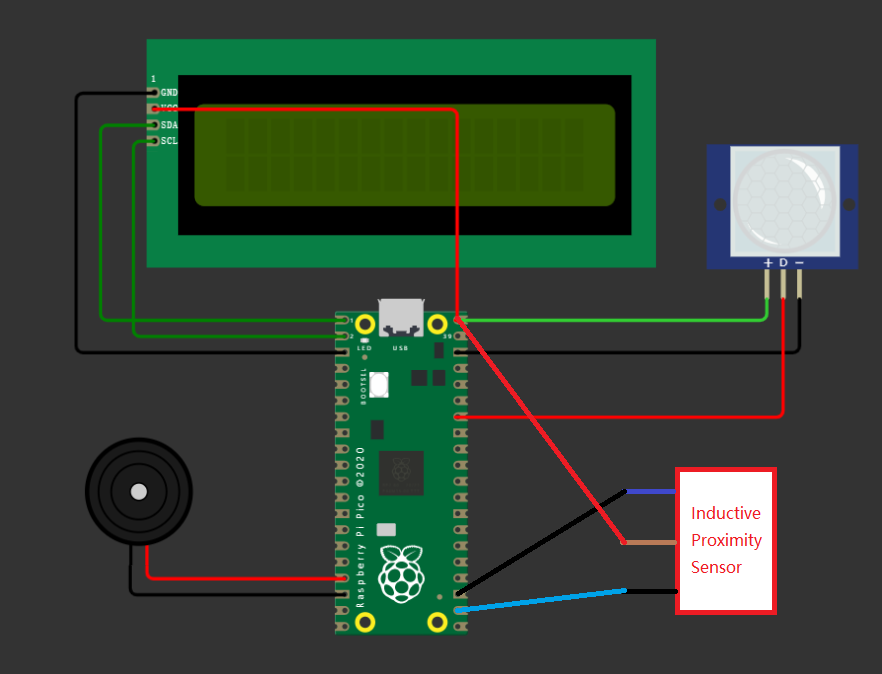

# Metal_Detector_Alarm

## Project Overview

The Metal Detector Alarm project is developed as an assignment for a school class. Its primary objective is to ensure the safety of the CT Scanning Room by examining individuals before they enter to determine if they are carrying any metal objects on or inside their bodies. The project incorporates a Raspberry Pi Pico, a PIR sensor, an inductive proximity sensor, a buzzer, and an LCD. By interacting with individuals approaching the CT Scanning Room, the system activates the metal detection sensor and triggers an alarm if any metal is detected. The purpose of the alarm is to alert individuals wearing metal objects and prevent them from entering the room, thereby safeguarding their health and maintaining the safety of the devices within the room.

## Features

- Motion sensing: A PIR sensor detects motion and initiates the metal detection process when someone approaches the CT Scanning Room.
- Metal detection: The project utilizes a metal detection sensor to identify the presence of metal objects.
- Proximity sensing: An inductive proximity sensor detects the presence of metal objects within close range.
- Alarm activation: If any metal is detected, the system activates an alarm to alert individuals wearing metal objects.
- Visual feedback: An LCD provides visual feedback on the detection status and alarm activation.
- Audio feedback: When metal is detected, a buzzer emits an audible alarm.
- Safety assurance: By preventing individuals with metal objects from entering the CT Scanning Room, the project ensures the safety of the room occupants and the integrity of the devices present.

## Hardware Components

- Raspberry Pi Pico
- PIR sensor (Passive Infrared Sensor)
- Inductive Proximity Sensor
- Buzzer
- LCD Display

## Installation and Setup

* The power supply for the PIR sensor, Inductive Proximity Sensor, and LCD is the VBUS port, which provides 5V voltage.
* Connect the PIR sensor to GP28, GND, and VBUS. It detects movement around it and passes the signal to the program to activate the Inductive Proximity sensor.
* Connect the Inductive Proximity Sensor to GP17, GND, and VBUS. It is activated by the PIR sensor and detects metal in its vicinity.
* Connect the buzzer to GP13 and GND. It produces a regular high-frequency sound when the alarm is activated by the Inductive Proximity Sensor, serving as a reminder.
* Connect the LCD Display to GND, GP0, GP1, and VBUS. It displays tips when movement is detected and provides feedback after the metal examination is complete.
* Download and install the required software dependencies on your Raspberry Pi Pico.
* Upload the project code onto the Raspberry Pi Pico.
* Power on the Raspberry Pi Pico.
### You may refer to the provided Wire Plan image in this project

## Usage

1. As someone approaches the CT Scanning Room, the PIR sensor detects their motion and initiates the metal detection process.
2. The inductive proximity sensor examines the individual to determine if they are carrying any metal objects.
3. If metal is detected, the buzzer emits an audible alarm, and the LCD provides a visual indication.
4. Individuals wearing metal objects should be alerted by the alarm and refrain from entering the CT Scanning Room.
5. After the individual moves away from the sensor range, the alarm stops, and the system resets to detect the next person.

## Project Credits

- Project Creator: Jiaqi Zhao ([@LX-Vincent](https://github.com/LX-Vincent))
- Project Development Period: May 2023 - June 2023

## License

This project is licensed under the **MIT License**. No warranty or guarantee is provided regarding the reliability of all codes. Please refer to the LICENSE file for more details.

## Acknowledgments

- I would like to express my sincere gratitude to my lecturer for teaching me Python programming and guiding me throughout the development of this project. Their expertise and support were invaluable in my learning process.
- Special thanks to my lecturer for providing the `i2c_lcd.py` and `lcd_api.py` files, which greatly assisted in implementing the LCD functionality in this project.
- I would also like to acknowledge the contributions of the Raspberry Pi Pico community for their resources, tutorials, and forums that helped me in understanding and utilize the capabilities of the Raspberry Pi Pico board.
- Lastly, I am grateful to my classmates and fellow students who provided feedback, assistance, and encouragement during the development of this project. Their support was instrumental in its successful completion.
